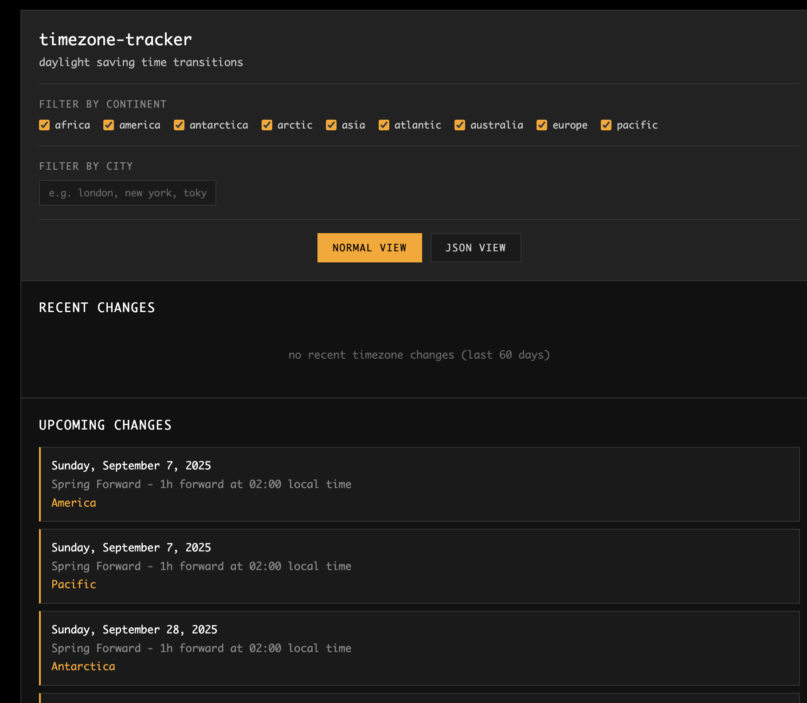

A micro web app to show you all upcoming timezone changes

Useful if you're debugging any timezone shenanigans in your own applications.

Just an index.html file. No dependencies

Uses the [Internationalization API](https://developer.mozilla.org/en-US/docs/Web/JavaScript/Reference/Global_Objects/Intl) to calculate shifts.

All rendered clientside, so if you're looking for an API for this data, this is the wrong place, but the code is trivial to copy
to implement yourself (unless you wanna setup a headless browser and run it through this for some reason)

See it on [tz.pert.dev](https://tz.pert.dev)

